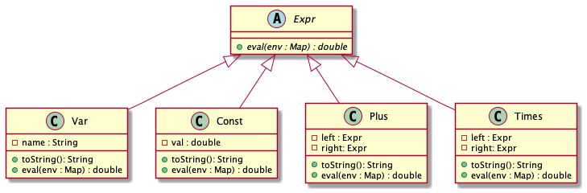
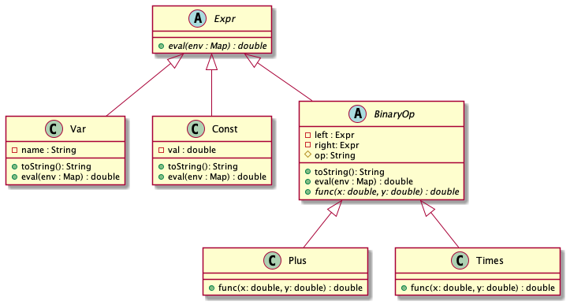

# Lecture l12

## Reading
Pre-read:
- Watch [Coding Trees in Python - Computerphile](https://www.youtube.com/watch?v=7tCNu4CnjVc)


Reading during break:

Additional reading:  


## Backlog
No backlog

## Course Review
With [Google Jamboard](https://jamboard.google.com/d/1O6m1cCIH-SjCmIwWQUoVC-aBw7t_1qUrKKUEv62YffM/edit?usp=sharing)

## Implement Coding Trees in Java
### Implement as presented in video.

Classes collected in `video` package.



```
@startuml
abstract Expr{
+ {abstract} eval(env : Map) : double
}
class Var{
- name : String
+ toString(): String
+ eval(env : Map) : double
}

class Const{
- val : double
+ toString(): String
+ eval(env : Map) : double
}

class Plus{
- left : Expr
- right: Expr
+ toString(): String
+ eval(env : Map) : double
}

class Times{
- left : Expr
- right: Expr
+ toString(): String
+ eval(env : Map) : double
}

Expr <|-- Const
Expr <|-- Var
Expr <|-- Times
Expr <|-- Plus

@enduml
```

### Introduce `BinaryOperation` class and refactor code.
Classes collected in `extended` package.



```
@startuml
abstract Expr{
+ {abstract} eval(env : Map) : double
}
class Var{
- name : String
+ toString(): String
+ eval(env : Map) : double
}

class Const{
- val : double
+ toString(): String
+ eval(env : Map) : double
}

abstract BinaryOp{
- left : Expr
- right: Expr
# op: String
+ toString(): String
+ eval(env : Map) : double
+ {abstract} func(x: double, y: double) : double
}

class Plus{
+ func(x: double, y: double) : double
}

class Times{
+ func(x: double, y: double) : double
}

Expr <|-- Const
Expr <|-- Var
Expr <|-- BinaryOp
BinaryOp <|-- Times
BinaryOp <|-- Plus

@enduml
```

## Exercises
No exercises
